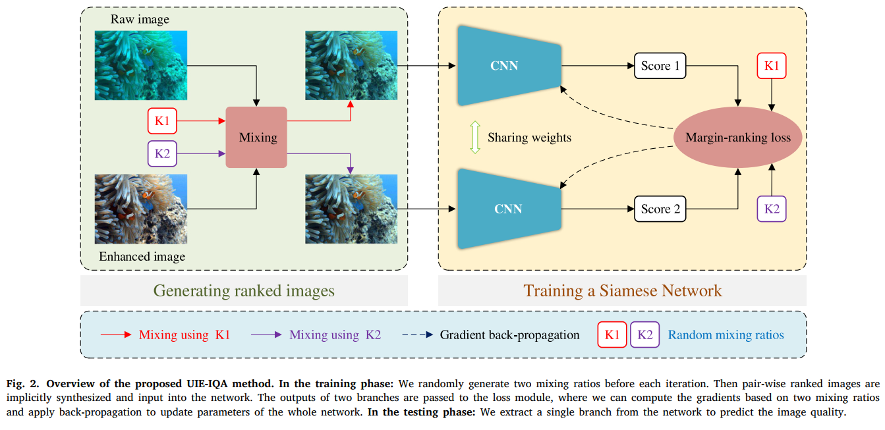

# A Rank Learning based Quality Assessment Approach For Underwater Image Enhancement (Signal Processing: Image communication, 2021) [(Paper)](https://www.sciencedirect.com/science/article/abs/pii/S0923596521003155)

The Pytorch Implementation of ''Unsupervised Underwater Image Restoration: From a Homology Perspective''. 

<div align=center></div>

## Introduction
In this project, we use Ubuntu 16.04.5, Python 3.7, Pytorch 1.7.1 and one NVIDIA RTX 2080Ti GPU. 

## Running

### Testing

Download the pretrained model [pre-trained model](https://pan.baidu.com/s/1ClGBtwXZzGrcLiwGf-IdfA (qacp))(qacp).

Check the model and image pathes in test.py, and then run:

```
python test.py
```

### Training

To train the model, you need to first prepare our [dataset](https://pan.baidu.com/s/10pSRRu9OyeaVh2ZlSh4BlA (lstd))(lstd). 

Check the dataset path in train.py, and then run:
```
python train.py
```

## Citation

If you find Twice-Mixing is useful in your research, please cite our paper:
```
@article{fu2022twice,
  title={Twice mixing: a rank learning based quality assessment approach for underwater image enhancement},
  author={Fu, Zhenqi and Fu, Xueyang and Huang, Yue and Ding, Xinghao},
  journal={Signal Processing: Image Communication},
  volume={102},
  pages={116622},
  year={2022},
  publisher={Elsevier}
}
```

**New:** The dataset and pre-trained model are available at [Google Drive](https://drive.google.com/drive/folders/11HWoy_7HGOMIcuMlqYqNOuojQDrkBdvw?usp=sharing)


